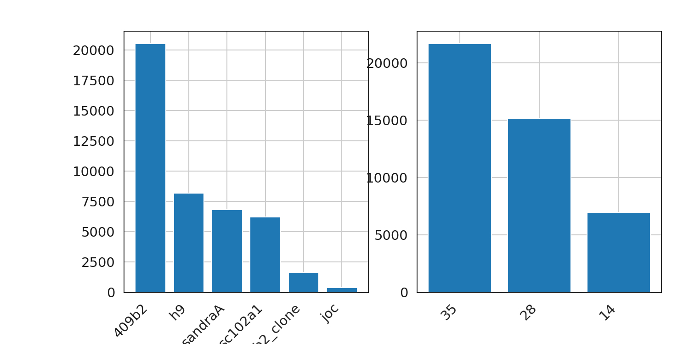
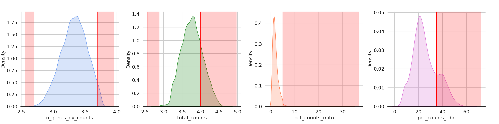

{
  "SEED": 42,
  "EXPERIMENT_ID": "SUBSET_1",
  "DESCRIPTION": "WO OPEN Dataset, WO BANOBO",
  "DATASETS": {
    "E-MATB": true,
    "MENDELEY": true,
    "OPEN": false
  },
  "SUBSET": {
    "APE_HUMAN_OVERLAP": true,
    "BANOBO": false,
    "TIMEPOINTS": [
      14,
      28,
      35,
      119,
      126
    ]
  },
  "PSEUDO_BULK": {
    "TYPE": "decoupler",
    "SIZE": 75,
    "REPS": 2
  },
  "CONTRAST": "",
  "QC": {
    "MIN_GENES": 500,
    "MAX_GENES": 5000,
    "MIN_COUNTS": 750,
    "MAX_COUNTS": 10000,
    "MT_PERCENTAGE": 5,
    "RB_PERCENTAGE": 35,
    "MIN_CELLS_PCT": 0.5
  }
}  
The 96% genes are overlaped bw Ape & Human in the data  
The 99% genes are overlaped bw ESCs & Induced in the data  
(43829, 16738)  
isspmatrix: True  
Loaded Filtered AnnData object: number of cells 43829  
Loaded Filtered AnnData object: number of genes 16738  
Available metadata for each cell:  Index(['timepoint', 'line', 'cluster', 'timepoint_mapped', 'batch', 'dataset',
       'isHuman', 'isESC'],
      dtype='object')  

  
Mitochondrial genes  
[ 0.          0.70244921  0.98710446  1.22562674  1.45492475  1.69154229
  1.9636058   2.29007634  2.75337838  3.54569077 34.53427065]  
Ribosomal Protein genes  
[ 1.47601476 13.64154741 17.09659889 19.51166821 21.51968941 23.69873817
 26.24517955 29.80791917 35.02994012 40.82365364 65.13915547]  
Total number of counts for each cell  
[  594.   2495.   3267.   4048.   4881.   5814.   6871.   8308.6 10377.8
 14193.2 57189. ]  
Number of genes detected in each cell  
[ 495.  1135.  1412.  1671.  1907.2 2164.  2447.  2783.  3221.  3917.
 6638. ]  

Thresholds applied  
43829 predicted doublets removed  
The selected filtering parameters are: 
 Minimum cells: 219.0
 Minimum counts: 750
 Maximum counts: 10000
 Minimum genes: 500
 Maximum genes: 5000
 Mitocondia: 5%
 Ribosomal: 35%  
After filtering on min detected genes:number of cells: 43764  
After filtering on min UMI counts:number of cells: 43755  
After filtering on mitochondrial RNA: number of cells: 43081  
After filtering on ribosomal protein RNA: number of cells: 34314  
Before gene filtering: number of genes: 16738  
Before gene filtering: number of cells: 34314  
219.0  
After gene filtering: number of genes: 14783  
After filtering: number of cells: 34314  
After applied filtering: number of cells: 34314  
After applied filtering: number of genes: 14783  
0:02:35.661879  
(34314, 14783)  
isspmatrix: True  
Loaded Filtered AnnData object: number of cells 34314  
Loaded Filtered AnnData object: number of genes 14783  
Available metadata for each cell:  Index(['timepoint', 'line', 'cluster', 'timepoint_mapped', 'batch', 'dataset',
       'isHuman', 'isESC', 'n_genes_by_counts', 'total_counts',
       'total_counts_mito', 'pct_counts_mito', 'total_counts_ribo',
       'pct_counts_ribo', 'QC_doublets', 'n_genes', 'n_counts'],
      dtype='object')  

Number of Higly Variable Genes  
0:06:24.881018  
